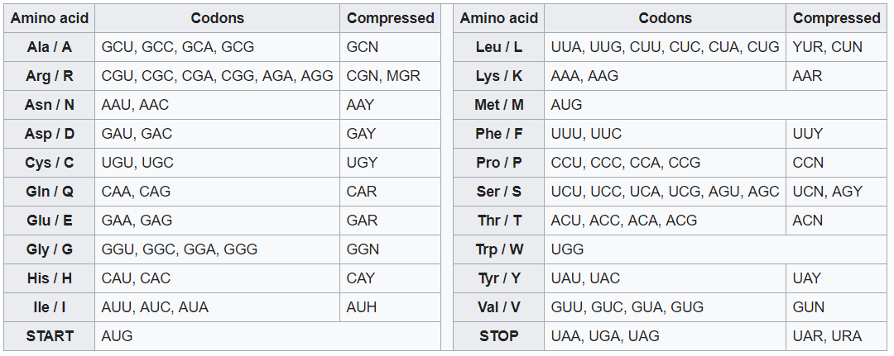

# HPC-Project-DNA
Module HPC: Final project of Special Topics of Telematics 2018-2, EAFIT University.

## Contents

- [Members](#Members)
- [Tasks and Videos](#Tasks-and-Videos)
- [Project description](#Project-description)
	- [Transcription: DNA to mRNA](#Transcription-DNA-to-mRNA)
	- [Translation: mRNA to protein](#Translation-mRNA-to-protein)
	- [Protein Counting](#Protein-Counting)
- [Configuration and installation](#Configuration-and-installation)
	- [MPI4PY](#MPI4PY)
	- [Python](#Python)
- [Running the code](#Running-the-code)
	- [serial version](#serial-version)
	- [parallel version](#parallel-version)
- [References](#References)

## Members

**Professor Guide:**
- Edwin Nelson Montoya Munera

**Students**
- Luis Miguel Marín Loaiza (Grupo 31)
- José Orlando Rengifo Caicedo (Grupo 31)
- Jorge Andrés Hoyos Gómez (Grupo 32)

## Tasks and Videos

Miguel : PCAM Design , Parallel version
Video:

Jose : PCAM Design, Serial version
Video:

Jorge : Serial version, Parallel version, Project description
Video: 

## Project description
The Main focus of the project is to receive whole genome sequence of DNA that can come from a bacteria, virus or human, and count the number of proteins in the sequence, to do this the DNA must be transcripted to mRNA and translated to protein, so we can finally make the count.

### Transcription: DNA to mRNA

First we will be performing a transcription from DNA to mRNA. During transcription, DNA is converted to messenger RNA (mRNA) by an enzyme called RNA polymerase in this project it will be converted by the algorithm . RNA is a molecule that is chemically similar to DNA, and also contains repeating nucleotide subunits. However, the “bases” of RNA differ from those of DNA in that thymine (T) is replaced by uracil (U) in RNA. DNA and RNA bases are also held together by chemical bonds and have specific base pairing rules. In DNA/RNA base pairing, adenine (A) pairs with uracil (U), and cytosine (C) pairs with guanine (G). The conversion of DNA to mRNA occurs when an RNA polymerase makes a complementary mRNA copy of a DNA “template” sequence. Once the mRNA molecule has been synthesized, specific chemical modifications must be made that enable the mRNA to be translated into protein.

### Translation: mRNA to protein 

After this the program will be performing a translation from mRNA to protein. During translation, mRNA is converted to protein. A group of three mRNA nucleotides encodes for a specific amino acid and is called a codon. Each mRNA corresponds to a specific amino acid sequence and forms the resultant protein. Two codons, called start and stop codons, signal the beginning and end of translation. The final protein product is formed after the stop codon has been reached. A table called the genetic code can be referred to in order to see which codons encode for which specific amino acids. Several of the codons end up encoding for the same amino acid, a process that is referred to as redundancy in the genetic code.
In the next picture we can see how the codons turns into proteins.

Given the genome, the program will go through it recognizing and changing every time it finds either a G–C–A–T or an N which stands for Not recognized, this happens when we find a different molecule that can either be a hydroxy methyl or hydroxy methyl glucose cytosine on viruses or variant bases with methyl groups or phosphosulfate may be found on mammals, for the purpose of this project we will not be counting this molecules.

### Protein Counting
Finally there will be two outputs:
1. The amount of proteins that there is in the given genome.
2. A file with the conversion from the DNA to protein sequence .

## Configuration and installation

This section specifies how to install and configure the technologies used to carry out this project.

### MPI4PY

the **Message Passing Interface**, is a standardized and portable message-passing system designed to function on a wide variety of parallel computers. The standard defines the syntax and semantics of library routines and allows users to write portable programs in the main scientific programming languages (Fortran, C, or C++).

[**Official installation link**](https://pypi.org/project/mpi4py/)

using pip:
~~~
$ [sudo] pip install mpi4py
~~~

or alternatively _setuptools_  **easy_install** (deprecated):
~~~
$ [sudo] easy_install mpi4py
~~~

This package provides Python links for the standard message passing interface (MPI). It is implemented on the MPI-1/2/3 specification and exposes an API that is based on the standard C ++ links of MPI-2.

[**Instructional link**](https://rabernat.github.io/research_computing/parallel-programming-with-mpi-for-python.html)

### Python

[Python](https://www.python.org/) is a modern, easy to learn, powerful programming language. It has efficient high-level data structures and a simple but effective approach to object-oriented programming with dynamic typing and dynamic binding. It supports modules and packages, which encourages program modularity and code reuse. Python’s elegant syntax, together with its interpreted nature, make it an ideal language for scripting and rapid application development in many areas on most platforms.

[**MPI for Python**](https://mpi4py.readthedocs.io/en/stable/)

MPI for Python provides an object oriented approach to message passing which grounds on the standard MPI-2 C++ bindings. The interface was designed with focus in translating MPI syntax and semantics of standard MPI-2 bindings for C++ to Python. Any user of the standard C/C++ MPI bindings should be able to use this module without need of learning a new interface.

To import the library use:
~~~
$ from mpi4py import MPI
~~~

## Running the code

~~~
$ mpirun -n <<processes>> python script.py
~~~

Here the -n << processes >> tells MPI to use the number of processes that you tell him, this number can not pass the number of cores you have on the machine to use. Then we tell MPI to run the python script named script .py

### Serial version
~~~
python src/
~~~

### Parallel version

## References
[1] http://knowgenetics.org/dna-and-proteins/

[2] https://en.wikipedia.org/wiki/Genetic_code
<!--stackedit_data:
eyJoaXN0b3J5IjpbLTIyNzQwODIwNiwtODg1NzU4MTExLDI2MT
k5NDExMiwtNTM4OTY0MTU0LDExNjg4MDE2ODQsLTI4OTk2ODE0
NCwtNDE5Nzc3NjE3LC02MjAwNTM0MjEsLTYxODMxMDIxNiwtND
g3NTQxNjgyLDEzNzAzMDgyNTEsNzc0NTgyODgzLDE2MDkyMDI1
MSwzNzEzMjI5MTAsMTkwMDY1ODQwNCwxMDg4NzA0MDE0LC0xMT
gzNDYyMDE1LC0xMDU3MDIxMjYwLC04Nzg2OTQyNzAsNDI0NTYw
NzFdfQ==
-->